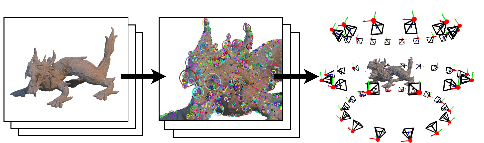

# OrthoSfM

Official implementation of **A Structure from Motion Pipeline for Orthographic Multi-View Images**. This software can accurately estimate poses and points from a set of images under orthographic projection.

## Installation
A prebuilt version for windows can be found here: **LINK** 

For building, the software requires the following third party libaries to be present:
- Ceres (**required**)
- Boost (**required**)
- Eigen3 (**required**)
- OpenCV (**required**)
- matplotlibcpp (_optional_ -> only necessary for _testbench_)

On Windows we **highly recommend** using vcpkg (https://vcpkg.io) to install the dependencies. 

### Build options:
-**DENABLE_TESTBENCH=True/False** --> For building the testbench application

-**DENABLE_CUDA=True/False** --> Enables CUDA based SIFT feature detection

## Datasets
- Full synthetic datasets: [Download](https://drive.google.com/file/d/1OhH9fRM32tckw20YjlY1syWuxUmqj7Cx/view?usp=sharing)
- Real datasets: [Download](https://drive.google.com/file/d/1Vq19ybqZeehg95YvyNChWj9lJkc2HFxP/view?usp=sharing) 
- Subsets of 3 images per dataset: [Download](https://drive.google.com/file/d/1tj4dlzt6TjyTrP-dFmp5j0v8YhWHx1XZ/view?usp=sharing)

## Example Usage 
One example how to use the compiled app is:
> orthosfm-app.exe {project folder} {Image Folder} 
--downscale-factor=2
--overwrite
--solver=0

A more detailed overview of the available parameters can be obtained by calling 
> orthosfm-app.exe --help
> 
> OrthoSfM: A simple Structure from Motion (SfM) implementation primarily for orthographic images
> 
> Usage:  OrthoSfM.exe [project folder] [image folder] --option1 value1 --option2 value2 \
> or      OrthoSfM.exe --project-folder [project folder] --image-folder [image folder] --option1 value1 --option2 value2
> 
> Allowed Additional options:\
> **--help** &nbsp;&nbsp;&nbsp;&nbsp; produce help message\
> **--project-folder** arg  &nbsp;&nbsp;&nbsp;&nbsp;    The folder where all temporary files and results
should be saved. This folder is required.\
> **--image-folder** arg   &nbsp;&nbsp;&nbsp;&nbsp;     A folder containing the images that should be used
as input. This folder is required.\
> **--calculated-tracks** arg &nbsp;&nbsp;&nbsp;&nbsp;  A track file containing previously calculated
tracks can be specified to avoid calculating them
on the fly\
> **--export-pairwise-tracks** &nbsp;&nbsp;&nbsp;&nbsp; Exports the tracks in a pairwise fashion usefull as
input to other sfm implementations\
> **--mask-folder** arg     &nbsp;&nbsp;&nbsp;&nbsp;    A folder containing a mask per image in the format
{imageName}_mask.png\
> **--downscale-factor** arg &nbsp;&nbsp;&nbsp;&nbsp;   The number of times the input images are downscaled
before using them for calculation\
> **--overwrite**      &nbsp;&nbsp;&nbsp;&nbsp;         Resets any old project in the same project folder and overwrites it with the new project.\
> **--solver** arg      &nbsp;&nbsp;&nbsp;&nbsp;        The solver used on the dataset [0 = Quaternion, 1 = EulerHorizontal, 2 = EulerHorizontalVertical, 3 = EulerAll]

## Testbench
We provide an application to systematically test the implementation on list of datasets.
> orthosfm-testbench.exe [project folder] [dataset folder] [executable path]

## Project Structure
The folder structure of the project follows the following sheme:
- <b>src/</b> -> contains all source code
    - **algortihms** -> Implementations of different camera models and reprojection errors
    - **app** -> The main command line executable
    - **bundle_adjustment** -> All code that is necessary to run a bundle adjustment
    - **cuda_sift** -> Code from (https://github.com/Celebrandil/CudaSift) for detecting SIFT features on the GPU
    - **data_structures** -> All data structures that are used as part of a reconstruction
    - **matching** -> Interface and implemntation of feature matching algorithms
    - **mve** -> Partial copy of the source code from (https://github.com/simonfuhrmann/mve) used for robust feature extraction and matching
    - **sfm** -> Contains the main pipeline that combines all other parts
    - **testbench** -> A test application used to systematically evaluate the implemented pipeline
    - **triangulation** -> Code to triangulate 3d point clouds from reconstruction data
    - **util** -> Some utility code that is reused by multiple libraries
- **resources** -> Contains three different models used inside the testbench
